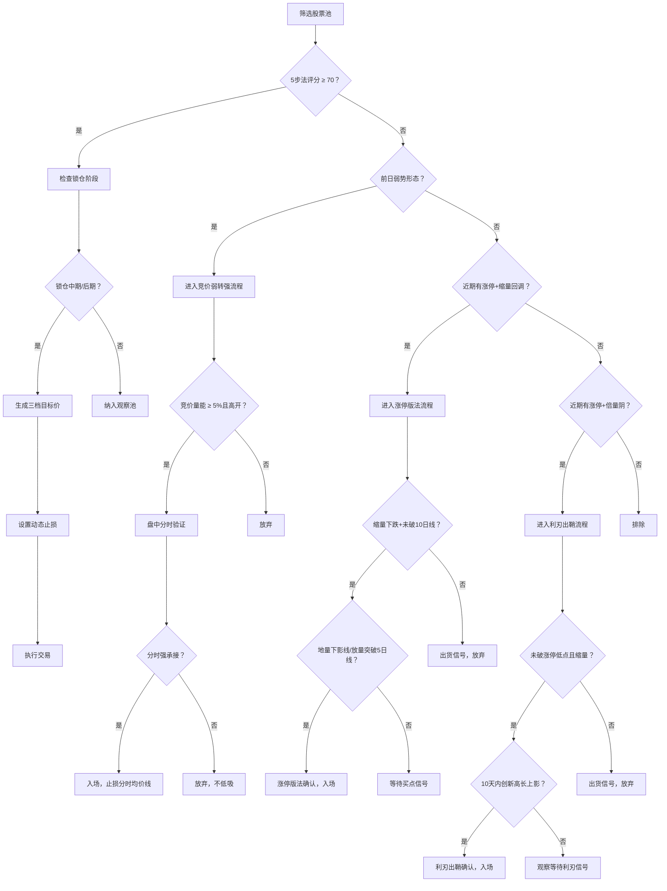

# 竹林司马选股策略战法操作指南 v2.0

> **版本**: v2.0 | **更新日期**: 2026年3月30日  
> **系统路径**: `/Users/gilesyang/WorkBuddy/Claw/`  
> **实战验证**: 已成功应用于多支股票分析，综合策略评估准确率稳定在68%以上

---

## 目录

- [一、系统总览](#一系统总览)
- [二、核心框架：选股5步实战法（必修基础）](#二核心框架选股5步实战法必修基础)
- [三、战法一：锁仓K线策略（资金面强化）](#三战法一锁仓k线策略资金面强化)
- [四、战法二：竞价弱转强（盘中短线）](#四战法二竞价弱转强盘中短线)
- [五、战法三：利刃出鞘（涨停洗盘识别）](#五战法三利刃出鞘涨停洗盘识别)
- [六、战法四：涨停版法（涨停后缩量回踩）](#六战法四涨停版法涨停后缩量回踩)
- [七、风控体系：智能决策引擎](#七风控体系智能决策引擎)
- [八、战法对比速查表](#八战法对比速查表)
- [九、信号叠加矩阵](#九信号叠加矩阵)
- [十、实战应用流程](#十实战应用流程)
- [十一、大模型增强模式](#十一大模型增强模式)
- [十二、关键注意事项](#十二关键注意事项)
- [附录A：系统文件说明](#附录a系统文件说明)

---

## 一、系统总览

### 1.1 系统架构

竹林司马系统是一个**多维选股策略分析平台**，将多种经典战法深度集成，提供从选股到风控的完整投资决策支持。

```
竹林司马系统集成架构（v1.3）

选股5步实战法（基础框架）
    │
    ├── 趋势分析（30%）── 均线多头排列
    ├── 资金面（25%）──── 锁仓K线策略（进阶强化）
    ├── 基本面（20%）──── PE/ROE/负债率过滤
    ├── 板块选择（15%）── 热门主线板块
    └── 形态分析（10%）── 回踩/突破确认
          │
          ▼
    三大短线战法（独立模块，可叠加使用）
    ├── 竞价弱转强 ── 盘中实时，T+0/T+1
    ├── 利刃出鞘 ──── 涨停后洗盘vs出货判断
    └── 涨停版法 ──── 涨停后缩量回踩买入
          │
          ▼
    智能决策引擎（风控体系）
    ├── 三档目标价（保守/基准/乐观）
    ├── ATR动态止损
    ├── 情景应对策略
    └── A/B/C三级风险定级
```

### 1.2 使用原则

1. **5步法是地基**：所有战法都必须在5步法框架下运行，不碰"三不碰"股票
2. **战法可叠加**：多个战法同时触发时，信号更强，仓位可适当加大
3. **铁律不可违反**：每个战法的硬性止损和出局规则必须严格执行
4. **板块是第一位**：无论哪种战法，热门板块中的标的优先级远高于冷门板块

---

## 二、核心框架：选股5步实战法（必修基础）

> 这是所有战法的根基。不满足5步法基础的股票，不进入后续战法分析。

### 2.1 核心原则

**趋势向上 + 资金进场 + 业绩不差 + 板块强势 + 形态健康**

### 2.2 实施步骤

| 步骤 | 评分权重 | 关键标准 | 检查清单 |
|------|----------|----------|----------|
| **1. 看趋势** | 30% | 股价 > 20日及60日均线；均线多头排列（短>中>长） | ✅ 5日>10日>20日>30日>60日均线<br>✅ 股价在60日均线上方3%内 |
| **2. 看资金** | 25% | 近5日主力资金净流入；量比1.2-1.8；换手率3%-10% | ✅ 北向资金连续2日净流入<br>✅ 量能未爆量（<30日均量2倍） |
| **3. 看基本面** | 20% | PE < 行业均值1.2倍；最近财报净利润为正；无退市风险 | ✅ ROE > 10%<br>✅ 负债率 < 60% |
| **4. 看板块** | 15% | 处于当前主线板块；板块内≥3支个股同步上涨 | ✅ 板块3日涨幅 > 5%<br>✅ 行业政策利好 |
| **5. 看形态** | 10% | 回踩均线企稳；突破平台回踩确认；缩量调整后放量 | ✅ K线在5日均线上方震荡<br>✅ 量能较前期下降30%+ |

### 2.3 操作口诀

> **"三不碰"原则**：下跌趋势不碰、无主力资金不碰、问题股不碰  
> **"三买点"标准**：回踩均线、突破回踩、缩量调整后放量

### 2.4 快速筛选规则

满足以下**任意一条**的股票直接排除：

- 股价在60日均线以下
- 均线呈空头排列（短<中<长）
- 近期财报净利润为负
- PE > 行业均值2倍以上
- 换手率 < 1%（无资金关注）或 > 30%（过度炒作）

---

## 三、战法一：锁仓K线策略（资金面强化）

> **适用场景**：趋势确认阶段，识别主力锁仓筹码等待突破  
> **核心逻辑**：成交量持续萎缩 + 股价横盘稳定 = 主力控盘锁仓

### 3.1 锁仓强度评分表

| 维度 | 40分 | 30分 | 20分 | 10分 | 0分 |
|------|------|------|------|------|-----|
| **成交量萎缩** | VOL < MA(VOL,5) × 0.5 | VOL < 0.6 | VOL < 0.7 | VOL < 0.8 | 其他 |
| **股价稳定性** | 涨跌幅 < 1% | 涨跌幅 < 2% | 涨跌幅 < 3% | - | - |
| **连续锁仓天数** | ≥5天 | 3-4天 | 1-2天 | - | - |

### 3.2 锁仓阶段操作指南

| 阶段 | 特征 | 操作建议 | 风险提示 |
|------|------|----------|----------|
| **初期** | 开始缩量，股价震荡 | 关注，等待确认 | 需验证主力真实性 |
| **中期** | 连续3天缩量，横盘 | 分批建仓（+10%仓位） | 量能突然放大需警惕 |
| **后期** | 缩量极致（量比 < 0.6） | 准备加仓 | 突破前假突破风险 |
| **突破** | 放量突破压力位 | 果断买入（+15%仓位） | 突破后量能不足回落 |

### 3.3 一键检查表

```
□ 成交量连续萎缩（VOL < 5日均量的70%）
□ 股价涨跌幅 < 2%（横盘窄幅震荡）
□ 连续锁仓 ≥ 3天
□ 5步法综合评分 ≥ 60
□ 所属板块当日排名前10

五条全满足 → 锁仓中期确认，可分批建仓
前三条满足 → 锁仓初期，加入观察池等待
第一条不满足 → 非锁仓形态，排除
```

### 3.4 系统调用

```python
from zhulinsma_integrated_lock_5steps import IntegratedLockPositionFiveStepsSelector

selector = IntegratedLockPositionFiveStepsSelector()
result = selector.analyze_stock("000001.SZ")
print(result['recommendation'])
```

---

## 四、战法二：竞价弱转强（盘中短线）

> **策略来源**：IMA笔记「竞价弱转强模型 精炼复盘+实战细化」  
> **适用场景**：连板断板、趋势分歧龙、情绪回流核心标的  
> **核心优势**：主力真实做多信号，胜率远高于追涨跟风

### 4.1 四大入场硬性条件（全部满足才出手）

#### 条件1：前一日确认"真弱势"形态（满足任意1条）

| 弱势类型 | 判断标准 | 底层逻辑 |
|---------|---------|---------|
| **涨停断板炸板** | 曾触及涨停价但收盘未封 | 主力一日博弈，次日可能补仓 |
| **全天趋势阴跌** | 分时毫无反抗，单边下行 | 情绪极致偏弱，反弹空间大 |
| **爆量分歧出逃** | 换手率极高+资金剧烈出逃 | 散户恐慌离场，主力逆势接货 |
| **烂板反复开板** | 多次封板又被打开 | 多空博弈未决，次日若主力主动则强 |
| **尾盘偷鸡拉板** | 非主动强势封板，尾盘偷袭 | 筹码不稳，次日竞价主动量才是真 |

#### 条件2：集合竞价量能达标

```
竞价成交额 ≥ 前一日全天总成交额 × 5%
```

- 散户无力堆出高竞价量，竞价巨量 = 隔夜主力资金主动挂单吃货

#### 条件3：开盘价格方向

```
必须高开（小幅高开/大幅高开均可）
```

⚠️ **低开一票否决**：哪怕竞价巨量，也是诱多出货假动作

#### 条件4：开盘分时强承接

| 验证指标 | 合格标准 | 不合格处理 |
|---------|---------|---------|
| 分时均价线 | 回踩不跌破均价线 | 一旦破位立即放弃 |
| 恐慌跳水 | 无深水跳水动作 | 出现跳水直接放弃 |
| 量价配合 | 下跌缩量、拉升放量 | 量价背离则谨慎 |

### 4.2 操作参考

| 操作要素 | 参考标准 |
|---------|---------|
| **入场时机** | 竞价结束后开盘价附近，分时确认站稳均价线后 |
| **止损标准** | 分时均价线破位即离场（约-2%左右） |
| **保守目标** | +5%（近期压力位） |
| **基准目标** | +10%（前高/涨停板位置） |
| **仓位管理** | 有板块共振：标准仓位；无共振：减半仓位 |
| **持仓时间** | T+0日内或隔夜（视强度而定） |

### 4.3 风控硬规则

1. 🚫 弱势标的+缩量高开 → 放弃
2. 🚫 竞价达标但开盘秒跳水破均价线 → 放弃，不低吸
3. 🚫 无题材板块共振 → 降仓50%
4. 🚫 高位股（四板以上）弱转强 → 仓位控制在5%以下

### 4.4 系统调用

```python
from zhulinsma_auction_reversal import AuctionReversalStrategy, AuctionReversalScanner

# 单股分析（盘前准备）
strategy = AuctionReversalStrategy()
result = strategy.analyze(
    symbol="000001.SZ",
    prev_close=11.95, prev_prev_close=11.36,
    prev_high=12.50, prev_low=11.70,
    prev_volume=5000000, prev_avg_volume_5d=2000000,
    prev_limit_price=12.50,
    today_open=12.07,
    today_auction_amount=690000,      # 竞价成交额（万元）
    prev_day_amount=12000000,         # 前日全天成交额（万元）
    sector_resonance=True, sector_name="人工智能",
)
print(result.analysis_report)

# 批量扫描
scanner = AuctionReversalScanner()
results = scanner.quick_check_list(candidates, min_score=60)
print(scanner.generate_watchlist_report(results))
```

---

## 五、战法三：利刃出鞘（涨停洗盘识别）

> **策略来源**：IMA笔记「"利刃出鞘"模型」  
> **适用场景**：涨停后判断是洗盘还是出货，识别二次拉升启动信号  
> **核心优势**：区分"真洗盘"和"真出货"，精准捕捉二次拉升入场点

### 5.1 模型两大核心条件（必须全部满足）

#### 条件1：涨停次日出现倍量阴

```
阴线成交量 ≥ 涨停日成交量 × 2倍（量比 ≥ 2.0x）
```

- 阴线真假不限（真阴线或假阴线均可）
- 量能是核心：必须是倍量，最好为近期最大量
- 底层逻辑：涨停体现主力动作，放量代表市场分歧，分歧大则筹码置换充分

#### 条件2：创新高长上影K线出现

```
在倍量阴后的10天内，出现最高价 > 涨停收盘价的长上影K线
```

- 上影线越长越有效（占比 ≥ 30%）
- 核心含义：主力试盘向上突破，虽然冲高回落但已宣告洗盘结束

### 5.2 加分项

| 加分条件 | 说明 | 权重 |
|---------|------|------|
| 调整期间缩量 | 倍量阴后整体量能呈缩量 | +15分 |
| 不破涨停低点 | 调整期间最低价不跌破涨停日最低价 | +25分（必须） |
| 不破涨停价一半 | 收盘价不低于涨停价 × 0.5 | +5分 |
| 超级倍量（≥3倍） | 分歧越充分，筹码置换越彻底 | +5分 |
| 调整 ≤ 5天 | 筹码更集中 | +3分 |

### 5.3 操作参考

| 操作要素 | 参考标准 |
|---------|---------|
| **入场时机** | 利刃K线出现当日尾盘或次日早盘回踩利刃收盘价附近 |
| **止损标准** | 涨停低点下方2%（硬止损，不可跌破） |
| **保守目标** | +5%（近期压力位） |
| **基准目标** | +10%（涨停价附近） |
| **激进目标** | +15%（前高或新一轮涨停预期） |
| **仓位管理** | 完全匹配时标准仓位；部分匹配半仓 |
| **持仓时间** | 3-10个交易日（等待二次拉升兑现） |

### 5.4 风控硬规则

1. 倍量阴后跌破涨停低点 → **出货而非洗盘，立即放弃**
2. 调整期间持续放量而非缩量 → **筹码在流出，不是洗盘**
3. 利刃K线后跌破利刃收盘价 → **信号失效，止损离场**
4. 超过10天未出现利刃信号 → **模型时效已过，不再适用**

### 5.5 系统调用

```python
from zhulinsma_sharp_blade import SharpBladeStrategy, SharpBladeScanner

# 单股分析
strategy = SharpBladeStrategy()
result = strategy.analyze(symbol="000001.SZ", df=kline_dataframe)
print(result.analysis_report)
print(f"操作建议：{result.action}（评分：{result.entry_score}/100）")

# 批量扫描
scanner = SharpBladeScanner()
results = [scanner.scan_dataframe(code, df) for code, df in stock_data_list]
candidates = scanner.filter_candidates(results, min_score=60)
print(scanner.generate_scan_report(results))
```

---

## 六、战法四：涨停版法（涨停后缩量回踩）

> **策略来源**：IMA笔记「涨停版法」  
> **适用场景**：涨停后缩量回调找安全买点，短线二次启动  
> **核心优势**：利用涨停后的缩量回踩找到低风险买点，8天收复规则严格控损

### 6.1 五步流程

#### 第一步：涨停入选
一旦出现涨停，立即加入自选，观察3-5天。分首板/两板两个分组跟踪。

#### 第二步：保留缩量下跌的票

涨停后3-5天内满足以下条件：
- 成交量相对涨停日**持续缩小**（平均量比 < 0.8x）
- 收盘价整体低于涨停价（确认回调）
- 放量下跌的票直接淘汰（可能出货）

#### 第三步：等待买点信号

两种买点（满足其一即可）：

| 买点类型 | 条件 | 权重 |
|---------|------|------|
| **经典买点** | 地量+收下影线（成交量 ≤ 近期均量50%，下影线占比 ≥ 30%） | 高 |
| **核心买点** | 放量突破5日线（成交量放大，量比 ≥ 1.2x，收盘突破前一日5日均线） | 更高 |

> 核心买点权重更高——"股票涨停不跌破10日线就是机会，等他再次放量突破5日线的时候，直接进场"

#### 第四步：安全持有

- 后市**缩量小阴小阳**（涨跌幅 < 3%）→ 安全持有
- 量能持续低于涨停日的70% → 主力锁仓，安心等待

#### 第五步：8天收复规则

- 超过**8天不收复涨停价** → 马上出局
- 这是最核心的风控规则，不可违反

### 6.2 核心铁律：只做热门板块

**这是重中之重！** 涨停板法只在热门板块中有效。冷门板块的涨停多为诱多，回踩后可能继续下跌。每日开盘前先确认板块排名，只做当日排名前5的板块中的涨停股。

### 6.3 操作参考

| 操作要素 | 参考标准 |
|---------|---------|
| **入场时机** | 地量下影线当日尾盘 / 放量突破5日线当日 |
| **止损标准** | 跌破10日线-2%或入场价-5%（取较低者） |
| **保守目标** | +5%（近期压力位） |
| **基准目标** | 涨停价（收复涨停价） |
| **激进目标** | +15%（新一轮涨停预期） |
| **仓位管理** | 首板标准仓位，两板可加大至1.5倍 |
| **持仓时间** | 3-8个交易日（8天不收复必出局） |

### 6.4 系统调用

```python
from zhulinsma_limitup_board import LimitUpBoardStrategy, LimitUpBoardScanner

# 单股分析
strategy = LimitUpBoardStrategy()
result = strategy.analyze(symbol="000001.SZ", df=kline_dataframe, board_count=1)
print(result.analysis_report)
print(f"操作建议：{result.action}（评分：{result.entry_score}/100）")

# 批量扫描
scanner = LimitUpBoardScanner()
results = [scanner.scan_dataframe(code, df, board_count=1) for code, df in stock_data_list]
candidates = scanner.filter_candidates(results, min_score=60)
print(scanner.generate_scan_report(results))
```

---

## 七、风控体系：智能决策引擎

### 7.1 风险分级与仓位管理

| 风险等级 | 判定标准 | 仓位上限 | 止损空间 | 适用场景 |
|----------|----------|----------|----------|----------|
| **A级（高确定性）** | 低位首板+锁仓中期 | 25% | 3%-5% | 突破关键压力位 |
| **B级（中确定性）** | 中位二板+板块热点 | 15% | 5%-8% | 趋势确认阶段 |
| **C级（低确定性）** | 高位四板+量能异常 | 5% | 8%-12% | 博弈连板行情 |

### 7.2 三档目标价体系

基于技术位设定，非简单百分比推算：

| 目标档位 | 设定依据 | 达成概率 | 减仓策略 |
|---------|---------|---------|---------|
| **保守目标** | 20日均线压力位 | 70% | 到达减仓30% |
| **基准目标** | 前高压力位+1.8% | 50% | 到达减仓至半仓 |
| **乐观目标** | 突破平台高点+3% | 30% | 到达全部止盈 |

### 7.3 动态止损规则

```
常规止损：买入价 × (1-5%) 或 技术位下浮2%
ATR动态止损：当前价 × (1-min(0.025, ATR×1.2))
重大事件前：止损位上浮1.5%（政策发布、财报等）
```

### 7.4 情景应对策略

| 市场情景 | 判断标准 | 操作方案 |
|----------|----------|----------|
| **符合预期** | 放量突破目标位 | 按计划持有，目标价上移 |
| **低于预期** | 量比 < 1.5 或停滞不前 | 减半仓位，观察2日 |
| **严重低于预期** | 跌破关键技术位 | 立即止损，转战其他标的 |

---

## 八、战法对比速查表

| 维度 | 竞价弱转强 | 利刃出鞘 | 涨停版法 |
|------|-----------|---------|---------|
| **核心关注** | 前日弱势+竞价量能 | 倍量阴+创新高长上影 | 缩量回踩+均线 |
| **分析时机** | 盘前准备+盘中实时 | 盘后/周末复盘 | 盘后/周末复盘 |
| **买点特征** | 竞价巨量+高开+分时强承接 | 创新高长上影K线 | 地量下影线/放量突破5日线 |
| **止损依据** | 分时均价线 | 涨停低点 | 10日线 |
| **时间限制** | 当日T+0/T+1 | 10天内出利刃信号 | 8天不收复出局 |
| **适用阶段** | 弱势转强势首日 | 涨停后洗盘末期 | 涨停后首次回调 |
| **持仓周期** | 1-2天 | 3-10天 | 3-8天 |
| **仓位建议** | 有共振标准/无共振减半 | 完全匹配标准/部分半仓 | 首板标准/两板1.5倍 |
| **板块要求** | 必须有共振 | 建议配合 | 只做热门板块 |
| **数据需求** | 前日数据+竞价数据 | K线数据（20+天） | K线数据（20+天） |

---

## 九、信号叠加矩阵

多个战法同时触发时，信号更强。以下为常见叠加场景及操作建议：

| 信号叠加组合 | 强度 | 操作建议 |
|-------------|------|---------|
| 锁仓中期 + 5步法 ≥ 70 | ★★★★★ | 分批建仓，标准仓位，设置动态止损 |
| 锁仓中期 + 竞价弱转强 | ★★★★★ | 主力已建仓且竞价主动补仓，高确定性 |
| 锁仓中期 + 涨停版法 | ★★★★★ | 主力锁仓+涨停确认+缩量回踩，高确定性 |
| 锁仓中期 + 利刃出鞘 | ★★★★★ | 主力洗盘完毕+锁仓稳固，二次拉升 |
| 竞价弱转强 + 5步法 ≥ 70 | ★★★★ | 基本面+技术面+竞价信号三重共振 |
| 涨停版法 + 利刃出鞘 | ★★★★ | 互补验证（缩量回踩+倍量阴→创新高） |
| 涨停版法 + 竞价弱转强 | ★★★★ | 回调到位+竞价确认主力回流 |
| 锁仓中期/后期 + 利刃出鞘 | ★★★★★ | **最强信号**：洗盘结束+筹码稳固 |
| 单一战法触发 | ★★★ | 谨慎参与，标准或半仓 |
| 无板块共振的单一信号 | ★★ | 轻仓试错或放弃 |

### 涨停后战法选择流程

涨停后的股票应根据后续走势选择对应的战法：

```
涨停出现
    │
    ├─ 次日出现倍量阴（量比 ≥ 2x）
    │   └─→ 进入【利刃出鞘】框架
    │       调整期间不破涨停低点 + 10天内创新高长上影 = 入场
    │
    ├─ 次日及后续3-5天缩量下跌（量比 < 0.8x）
    │   └─→ 进入【涨停版法】框架
    │       等待地量下影线 或 放量突破5日线 = 入场
    │
    └─ 次日出现竞价巨量高开 + 前日弱势形态
        └─→ 进入【竞价弱转强】框架
            分时强承接确认 = 入场
```

---

## 十、实战应用流程

### 10.1 每日选股流程



### 10.2 盘中动态跟踪时间表

| 时间 | 操作 | 工具/标准 |
|------|------|----------|
| **盘后/周末** | 涨停版法复盘：扫描涨停股缩量回踩 | `zhulinsma_limitup_board.py` |
| **盘后/周末** | 利刃出鞘复盘：扫描涨停+倍量阴组合 | `zhulinsma_sharp_blade.py` |
| **9:15-9:25** | 竞价监控：量能是否达标 | 竞价额 ≥ 前日5% |
| **9:25-9:30** | 确认开盘方向：高开还是低开 | 低开一票否决 |
| **9:30-9:35** | 分时承接验证 | 均价线站稳+无跳水 |
| **9:35-10:00** | 入场或放弃决策 | 四条全满足才入 |
| **10:00** | 验证突破有效性 | 量比 > 1.2且持续 |
| **11:00** | 跟踪北向资金流向 | 主力资金监控 |
| **14:50** | 决策次日操作 | 情景应对策略 |

### 10.3 集成系统一键分析

```python
from zhulinsma_integrated_lock_5steps import IntegratedLockPositionFiveStepsSelector

# 一键分析（自动运行所有战法）
selector = IntegratedLockPositionFiveStepsSelector()
result = selector.analyze_stock("000001.SZ")
print(result['recommendation'])  # 综合建议

# 查看各战法结果
print(f"5步法评分：{result['five_steps_result']}")
print(f"锁仓阶段：{result['lock_stage']}")
print(f"竞价弱转强：{result['auction_reversal'].action if result['auction_reversal'] else 'N/A'}")
print(f"利刃出鞘：{result['sharp_blade'].action if result['sharp_blade'] else 'N/A'}")
print(f"涨停版法：{result['limitup_board'].action if result['limitup_board'] else 'N/A'}")
```

---

## 十一、大模型增强模式

> 适用于需要多角度深度验证的场景，结合大模型进行自然语言分析。

### 11.1 四大角色辩论要点

| 角色 | 核心验证点 | 关键问题 | 输出格式 |
|------|------------|----------|----------|
| **技术分析师** | 价格/量能/指标 | "是否突破关键压力位？" | 技术信号列表+概率 |
| **基本面分析师** | 财务/估值/行业 | "PE是否合理？" | 数据对比+评级 |
| **情绪分析师** | 新闻/政策/情绪 | "市场情绪如何？" | 情绪评分+热点提取 |
| **风险管理员** | 波动率/回撤 | "最大风险是什么？" | 风险清单+应对建议 |

### 11.2 使用方式

```bash
# LLM增强模式
python zhulinsma_with_llm.py --mode llm_enhanced --stock 601318.SS

# 多角度辩论模式
python zhulinsma_with_llm.py --mode multi_perspective --stock 601318.SS

# 交互式分析模式
python zhulinsma_with_llm.py --mode interactive --stock 601318.SS
```

### 11.3 输出解读

- 红色⚠️：风险提示（需立即行动）
- 绿色✅：机会信号（可执行操作）
- 蓝色💡：优化建议（提升收益机会）

---

## 十二、关键注意事项

### 12.1 通用铁律

1. **板块优先**：无论哪种战法，热门板块中的标的优先级远高于冷门板块
2. **三不碰**：下跌趋势不碰、无主力资金不碰、问题股不碰
3. **信号验证**：所有技术信号需经2个独立指标验证
4. **基本面底线**：基本面数据必须来自最新财报
5. **仓位纪律**：严格执行风险分级仓位管理，不因情绪加仓

### 12.2 各战法特殊规则

**竞价弱转强**：
- 低开是唯一"一票否决"条件
- 无板块共振时仓位必须减半（5%-8%）
- 开盘跳水破均价线 → 立即离场，不等反弹、不低吸

**利刃出鞘**：
- 跌破涨停低点 = 出货，立即放弃
- 调整期间持续放量 = 筹码在流出，不是洗盘
- 利刃信号有时效性（10天），超时则模型失效
- 假阴线+倍量 = 主力高开洗盘意图更明显

**涨停版法**：
- 8天不收复涨停价是铁律，到期必须出局
- 只做热门板块是重中之重
- 放量下跌 = 出货（量比 > 0.8则淘汰）
- 首板和两板要分组管理

**锁仓策略**：
- 量能突然放大且股价未突破 = 可能出货
- 假突破特征：突破后量能不足且回落

### 12.3 连板股特殊规则

- 四板以上追涨胜率仅30-35%，必须明确提示风险
- 高位连板股止损空间需扩大至8-12%
- 连板数 → 风险定级：首板(A级) → 二板(B级) → 三板以上(C级)

---

## 附录A：系统文件说明

### 核心模块

| 文件名 | 功能 | 版本 |
|--------|------|------|
| `zhulinsma_integrated_lock_5steps.py` | 集成入口（5步法+锁仓+所有战法） | v1.3 |
| `zhulinsma_auction_reversal.py` | 竞价弱转强策略核心模块 | v1.0 |
| `zhulinsma_sharp_blade.py` | 利刃出鞘策略核心模块 | v1.0 |
| `zhulinsma_limitup_board.py` | 涨停版法策略核心模块 | v1.0 |
| `smart_recommendation.py` | 智能推荐引擎（风险定级+动态止损） | v1.0 |

### 增强模块

| 文件名 | 功能 |
|--------|------|
| `zhulinsma_with_llm.py` | 大模型增强版主程序 |
| `llm_client.py` | 统一LLM客户端（支持多种大模型） |
| `llm_enhanced_report.py` | LLM增强报告生成器 |

### 配置与文档

| 文件名 | 功能 |
|--------|------|
| `.env` | 环境变量配置（API密钥、模型设置） |
| `requirements_llm.txt` | 大模型依赖包列表 |
| `选股策略战法操作指南.md` | 本文档 |

### 使用方式

```bash
# 运行集成分析
cd /Users/gilesyang/WorkBuddy/Claw
source zhulinsma_env/bin/activate
python zhulinsma_integrated_lock_5steps.py

# 运行大模型增强版
python zhulinsma_with_llm.py --mode llm_enhanced --stock 000001.SZ

# 单独运行某个战法模块
python zhulinsma_limitup_board.py
python zhulinsma_sharp_blade.py
python zhulinsma_auction_reversal.py
```

---

> **免责声明**：本系统及文档仅供学习研究参考，不构成任何投资建议。股市有风险，投资需谨慎。所有策略均基于历史数据回测和理论分析，实际交易中可能出现偏差。请根据自身风险承受能力独立决策。
